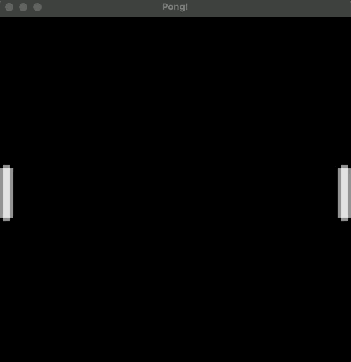

# 🕹️ Pong 🕹️

The classic pong game written in Rust! This project is still a WIP.



## Table of Contents

- [Pong](#pong)
- [Used Technologies](#used-technologies)
- [Running locally](#running-locally)
- [Testing](#testing)

### Pong

[Pong](https://en.wikipedia.org/wiki/Pong) is a classic tennis-based arcade game which was designed by Atari in 1972. This project was created for educational purposes and is a short and humble remake of the game using Rust and Amethyst as the game engine and by following the pong chapter in [Amethyst's book](https://book.amethyst.rs/book/stable/intro).

To sum up: a project to study `Rust` and some of its gaming capabilities ;)

### Used Technologies

The main technologies used (so far):

- `rustc` compiler - `1.51.0`;
- `amethyst` - `0.15.3`;

[Amethyst(https://amethyst.rs/) is an ECS (Entity Component System) based game engine which was used to power the game logic, state and graphics. Amethyst uses [Metal](https://developer.apple.com/metal/) as the main API for using MacOS's GPU.

### Running Locally

To hit the ground quickly, use [Cargo](https://doc.rust-lang.org/cargo/):

```sh
cargo run
```

This will compile the game in development mode and run it which should render the game screen.

### Running Tests

Use cargo, but the tests are still WIP!

```sh
cargo test  # WIP!
```
